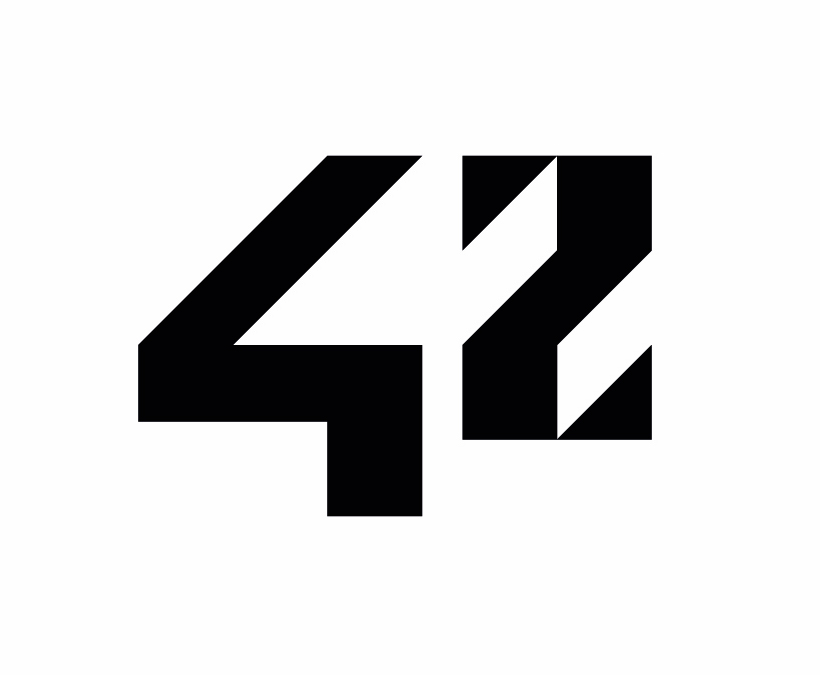

 

  
   
   
  

    
  
 
   
  <h1>42 Malaga</h1>
   

## About 42

42 is a future-proof computer science training to educate the next generation of software engineers. The 42 program takes a project-based approach to progress and is designed to develop technical and people skills that match the expectations of the labor market.

<a href="https://42.fr/en/homepage/"><strong>More info about 42... »</strong></a>

 

## 42 Projects Score

| Project | Rank | Score |
| ------ | ------ | ------ |
| [Libft](https://github.com/pvaladares/42cursus-00-Libft) | 0 |  |
| [Born2beRoot](https://github.com/pvaladares/42cursus-01-Born2BeRoot) | 1 |  |
| [ft_printf](https://github.com/pvaladares/42cursus-01-ft_printf) | 1 |  |
| [get_next_line](https://github.com/pvaladares/42cursus-01-get_next_line) | 1 |  |
| [minitalk](https://github.com/pvaladares/42cursus-02-minitalk) | 2 | 
| [fract-ol]() | 2 | 
| [push_swap](https://github.com/pvaladares/42cursus-02-push_swap) | 2 | 

